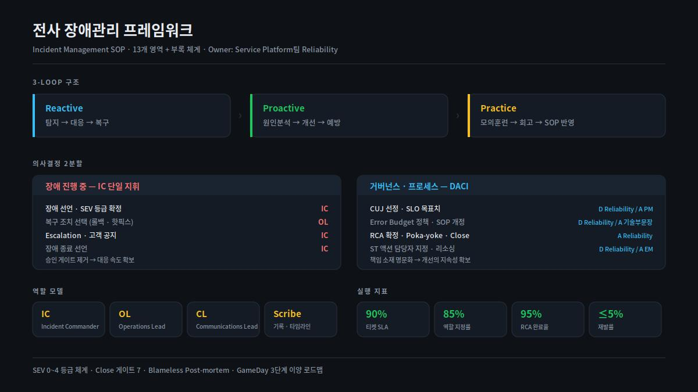

[← 포트폴리오](../README.md) · [무신사](../companies/musinsa.md)

# 전사 장애관리 프레임워크

> 흩어진 장애 대응을 SEV 등급부터 Close 게이트까지 13개 영역으로 문서화해 전사에 정착시켰습니다.
> RCA 확정의 최종 Approver.

| 조직 | 시기 | 역할 |
|---|---|---|
| 무신사 · 29CM | 2025.01 – 진행 중 | Incident Owner (설계 · 승인) |

---

## 문제

장애 대응이 조직마다 다르게 이뤄지고 있었습니다.

- **등급 기준이 없었습니다.** 같은 규모의 장애가 팀에 따라 다르게 취급됐고, 그래서 어디까지 알려야 하는지도 매번 달랐습니다.
- **지휘 주체가 불명확했습니다.** 대응 중에 "이 조치를 해도 되는가"를 묻느라 복구가 지연되는 일이 반복됐습니다.
- **종료 기준이 없었습니다.** 장애가 언제 끝난 것인지 판단이 사람마다 달라, 재발 방지 조치 없이 닫히는 티켓이 있었습니다.
- **반복을 반복이라고 부를 수 없었습니다.** 공통 데이터가 없으니 같은 원인의 장애가 몇 번째인지 아무도 몰랐습니다.

## 제약

- Reliability 팀이 모든 장애를 직접 대응할 수는 없습니다. **각 개발조직이 스스로 굴릴 수 있는 체계**여야 했습니다.
- 규정을 늘리면 대응이 느려집니다. **통제와 속도를 동시에** 가져가야 했습니다.
- 기존에 각 조직이 쓰던 방식을 전부 폐기할 수는 없었습니다.

## 설계

### 1. 의사결정을 둘로 나눴다

가장 중요한 결정이었습니다. 장애 대응은 **속도**가, 거버넌스는 **책임 소재**가 중요한데
두 개를 하나의 승인 절차로 묶으면 둘 다 잃습니다.

| 구분 | 방식 | 대상 |
|---|---|---|
| **장애 진행 중** | IC 단일 지휘 — 승인 게이트 **제거** | 장애 선언, SEV 등급 확정, 복구 조치 선택(롤백·핫픽스), Escalation, 고객 공지, 종료 선언 |
| **거버넌스 · 프로세스** | **DACI** | CUJ 선정, SLO 목표치, Error Budget 정책, SOP 개정, RCA 확정, 액션 담당자 지정, 리소싱 |

장애 중에는 IC가 혼자 결정합니다. 대신 그 결정의 **기준**은 사전에 DACI로 합의해 둡니다.
현장에서 협의할 것을 없애고, 협의할 것은 현장 밖에서 끝내는 구조입니다.

### 2. 역할 모델과 운영 원칙

- **IC** (Incident Commander) — 지휘 · 선언 · 종료
- **OL** (Operations Lead) — 복구 조치 실행
- **CL** (Communications Lead) — 내부 전파 · 고객 공지
- **Scribe** — 기록 · 타임라인

6대 운영 원칙 — **복구 우선 · 높게 선언 · 역할 분리 · 즉시 전파 · Blameless · 재발 방지**

"높게 선언"은 의도적으로 넣었습니다. 과소 선언의 비용이 과대 선언의 비용보다 항상 큽니다.
낮게 부르면 사람이 안 모이고, 높게 부르면 나중에 내리면 됩니다.

### 3. 3-Loop 구조

```
Reactive    탐지 → 대응 → 복구
Proactive   원인분석 → 개선 → 예방
Practice    모의훈련 → 회고 → SOP 반영
```

대부분의 조직은 Reactive만 갖고 있습니다. Proactive가 없으면 같은 장애가 반복되고,
Practice가 없으면 Reactive가 실제 상황에서 작동하는지 알 수 없습니다.

### 4. Close 게이트를 긍정 조건으로 기술했다

처음에는 "무엇이 없으면 닫을 수 없는가"로 썼는데, 그러면 게이트가 처벌처럼 읽힙니다.
**"무엇이 갖춰지면 닫을 수 있는가"** 로 다시 썼습니다. 같은 항목인데 통과율이 달라졌습니다.

### 5. 용어를 중립화했다

티켓 생성 경로를 "표준 / 예외"로 부르던 것을 **"자동 / 수동"** 으로 바꿨습니다.
"예외"라는 말이 붙으면 수동 경로를 쓴 조직이 규정을 어긴 것처럼 읽혀서, 실제로는 수동이 맞는 상황에서도 사람들이 피했습니다.

문서 전반에서 "Drill"을 **"장애모의훈련"** 으로 통일하고, ASCII 플로우차트를 Mermaid 다이어그램으로 교체했습니다.



---

## 결과

| 지표 | 목표 |
|---|---|
| 티켓 SLA 준수율 | 90% |
| 역할 지정률 | 85% |
| RCA 완료율 | 95% |
| 재발률 | 5% 이하 |

- **전사 공통 언어가 생겼습니다.** "SEV2"라고 말하면 조직이 같은 것을 떠올립니다.
- **승인 대기 시간이 사라졌습니다.** 장애 중 결정은 IC가 합니다.
- 본 문서는 v4.4 → v4.6까지 개정됐고, 12개 본문과 A·B 부록 체계로 확장됐습니다.

## 회고

**문서의 문제는 대부분 내용이 아니라 단어였습니다.** "예외", "표준", "결함" 같은 말이 붙으면
사람들은 규정을 지키기보다 규정을 피하는 쪽으로 움직입니다. 통과율을 올린 건 기준 완화가 아니라 표현 교체였습니다.

**승인을 없애는 것이 통제를 없애는 것은 아닙니다.** 장애 중 승인을 제거할 수 있었던 건
그 결정의 기준을 사전에 합의해 뒀기 때문입니다. 통제의 위치를 현장에서 설계 시점으로 옮긴 것에 가깝습니다.

---

**관련 케이스** — [전사 SLO 체계](02-company-wide-slo.md) · [비상대응훈련 프로그램](03-incident-drill-program.md) · [신뢰성 자동화](04-reliability-automation.md)

`SEV 등급` `IC 지휘체계` `DACI` `Blameless Post-mortem` `Close 게이트` `Confluence` `Jira`
