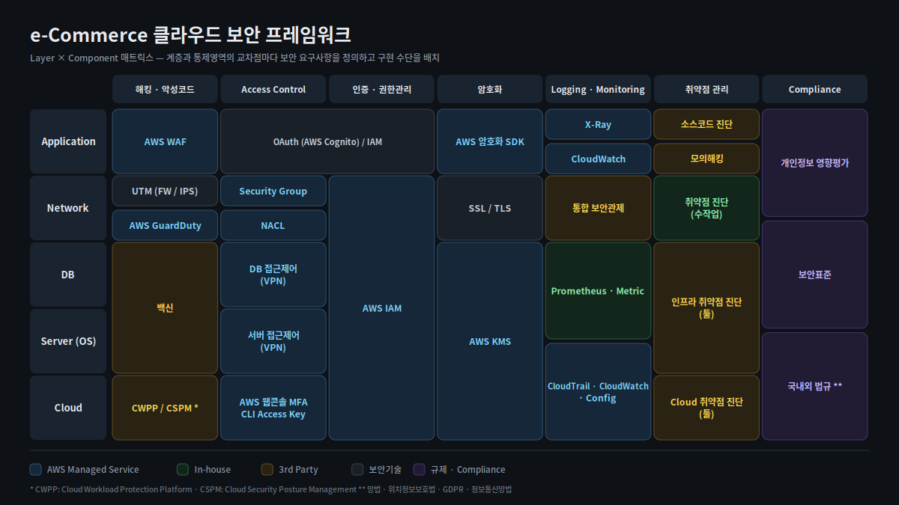

[← 포트폴리오](../README.md) · [스타랩스](../companies/starlabs.md) · [트렌비](../companies/trenbe.md)

# 클라우드 보안 프레임워크와 ISMS-P 심사 대응

> 보안 장비를 얹는 대신 **관리형 서비스로 요건을 충족하는 프레임워크**를 설계해 심사 승인을 받았고,
> 이후 e-Commerce 환경에 맞춰 재설계해 3년여 보안 무사고 운영으로 이어졌습니다.

| 조직 | 시기 | 역할 |
|---|---|---|
| 스타랩스 (LG CNS 플랫폼사업) | 2018.11 – 2020.01 | **ISMS-P 심사 대응 스크럼마스터** — 프레임워크·가이드라인 설계 |
| 트렌비 | 2021.06 – 2024.12 | CISO — 재설계 · 운영 |
| 무신사 | 2025.01 – | 인증심사 대응 |

---

## 문제

당시 관행은 **클라우드에도 기존 보안 장비를 그대로 얹는 것**이었습니다.

물리 환경에서 쓰던 방화벽·IPS·망분리 장비를 가상 어플라이언스로 올리는 방식인데,
비용도, 운영 부담도, 클라우드를 쓰는 이유도 그만큼 사라집니다.

그런데 이 관행이 유지된 데는 이유가 있었습니다. **심사에서 방어할 방법이 없었기 때문**입니다.
"방화벽이 있는가"라는 질문에 "Security Group과 NACL이 그 역할을 합니다"라고 답하려면,
그것이 왜 동등하거나 더 나은지를 근거로 보여야 하는데 그 근거 체계가 없었습니다.

## 제약

- 심사 항목은 물리 환경을 전제로 쓰여 있었습니다.
- 그룹사 여러 곳에 적용할 수 있어야 했습니다(스타랩스). 한 프로젝트용 설계로는 의미가 없었습니다.
- 트렌비에서는 **보안 인력이 사실상 없었습니다.** 운영 부담이 큰 통제는 도입 자체가 불가능했습니다.

## 설계

### Layer × Component 매트릭스

계층과 통제영역의 **교차점마다 보안 요구사항을 정의하고 구현 수단을 배치**했습니다.

|  | 접근제어 | 인증/권한 | 암호화 | Logging/Monitoring | 취약점 | Compliance |
|---|---|---|---|---|---|---|
| **Application** | | | | | | |
| **Network** | | | | | | |
| **DB** | | | | | | |
| **Server (OS)** | | | | | | |
| **Cloud** | | | | | | |

각 칸이 **AWS 관리형 서비스인지 · 자체 구현인지 · 3rd Party인지**를 구분해 두면
"이 요건은 무엇으로 충족되는가"에 항상 답할 수 있습니다. 심사 대응은 이 표를 읽는 일이 됩니다.

*트렌비 버전 — LG에서 설계한 프레임워크를 e-Commerce 환경에 맞춰 재설계*

### 1기 — LG CNS 플랫폼사업 (스타랩스)

**ISMS-P 심사 대응의 스크럼마스터**로 보안 프레임워크와 가이드라인을 제시했습니다.

- **별도 장비 없이 AWS Managed Service만으로 ISMS-P 요건을 충족**하는 프레임워크를 설계해 심사 승인
- 요건별로 **어떤 관리형 서비스가 무엇을 대체하는지 근거를 작성**해 심사에 대응
- **망분리(VDI)를 프레임워크의 통제 항목으로 포함**해 설계 — 이 시점의 선택은 VDI였습니다
- **LG화학 · LG디스플레이 · LG CNS 운영 가이던스로 확산**

### 2기 — 트렌비 재설계

e-Commerce 환경은 다릅니다. 트래픽 패턴도, 개인정보 처리량도, 인력 규모도.

- **망분리 요건을 SDN · Okta 기반 ZTNA로 구현** — 별도 장비 없이 **Identity 식별만으로 요건 충족**
- Okta 기반 SSO/SAML로 전사 애플리케이션 인증체계 단일화
- WAF 구축, 클라우드 리소스 Private 전환 (80/443 외 차단)
- 갱신 심사에서 지적된 **Logging 정책 · 접근제어 결함 조치 완료**

망분리를 장비가 아니라 Identity로 구현한 것이 이 버전의 핵심입니다.
물리 분리는 장비와 회선과 운영 인력을 모두 요구하지만, ZTNA는 **누가 무엇에 접근하는가**를
단일 지점에서 판정합니다. 인력이 없는 조직에서는 이 차이가 도입 가능 여부를 가릅니다.

### 3기 — 작업환경 자체를 클라우드 안으로 (트렌비)

접근 경로를 통제하는 것과, 작업이 일어나는 **장소**를 옮기는 것은 다른 문제입니다.

- **로컬 단말에서는 운영 환경에 직접 접근할 수 없도록 차단**
- EKS 운영을 **AWS Cloud9 기반 클라우드 개발·운영 스튜디오 안에서만** 수행하도록 구성
- 운영 자격증명과 소스가 개인 단말에 남지 않고, 작업 이력이 클라우드에 집중됨

VDI가 푸는 문제를 클라우드 네이티브 방식으로 푼 구성입니다.
보안 통제를 위해 운영 편의를 희생한 것이 아니라, **EKS 운영 효율을 함께 얻은 선택**이었습니다.
통제가 일을 더 불편하게 만들면 사람들은 우회로를 찾습니다.

> **망분리 한 주제를 세 가지 방식으로 — VDI 통제 설계 → Identity 기반 ZTNA → 클라우드 작업환경 분리.**
> 환경과 인력 규모에 따라 어느 쪽이 맞는지 근거를 갖고 판단할 수 있게 된 건 세 번 다 해봤기 때문입니다.

---

## 결과

- **ISMS-P 심사 승인** (LG CNS 플랫폼사업) — 별도 보안 장비 없이
- **3개 계열사 운영 가이던스로 확산**
- 트렌비 **3년여 보안 무사고 운영**
- 갱신 심사 결함 조치 완료
- 무신사에서 ISMS-P 인증심사 대응 수행

## 회고

**심사 대응의 핵심은 기술이 아니라 번역이었습니다.**
같은 통제 목적을 다른 수단으로 달성했다는 것을, 심사 기준의 언어로 설명할 수 있어야 합니다.
이 방법론은 이후 [금융권 컨테이너 규제 대응](10-financial-container-compliance.md)과
[개인정보 현장점검 대응](06-privacy-incident-response.md)에서 그대로 재사용됐습니다 —
**통제 항목 × 구현 근거 매핑.**

**매트릭스의 진짜 값은 심사가 아니라 평시에 나왔습니다.**
새 서비스를 올릴 때 "이 계층의 이 통제는 무엇으로 하는가"가 표에 이미 있으니
매번 처음부터 설계하지 않게 됩니다. 심사용 문서로 만들었는데 아키텍처 표준으로 쓰였습니다.

---

**관련 케이스** — [개인정보 유출 사고 대응](06-privacy-incident-response.md) · [금융권 컨테이너 규제 대응](10-financial-container-compliance.md) · [EKS 플랫폼 리빌드](08-eks-platform-rebuild.md)

`ISMS-P` `AWS Managed Service` `Okta ZTNA` `SSO/SAML` `SDN 망분리` `WAF` `GuardDuty` `CWPP/CSPM`
