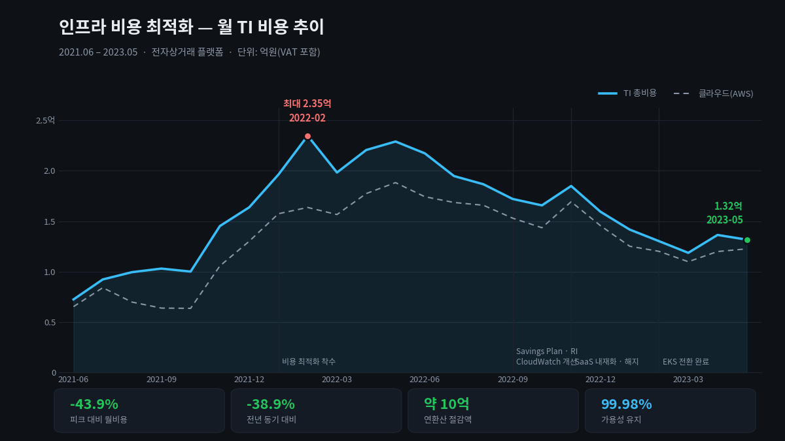

[← 포트폴리오](../README.md) · [트렌비](../companies/trenbe.md)

# 클라우드 비용 최적화와 제3자 의존성 제거

> 월 인프라 비용 **43.9% 절감**(연환산 약 10억 원)으로 기업 BEP 달성에 직접 기여하고,
> MSP 기술지원 없이 자체 운영으로 전환해 외부 의존성을 구조적으로 제거했습니다.

| 조직 | 시기 | 역할 |
|---|---|---|
| 트렌비 | 2021.06 – 2024.12 | SRE Lead — 비용 · 계약 총괄 |

**출발점** — 비용 관리 체계 없음. 인프라 비용 우상향. 명목상 MSP에 운영을 맡기고 있었으나 실제 통제권은 안에도 밖에도 없음.

---

## 문제

비용이 오르는 것 자체보다, **왜 오르는지 설명할 수 없다는 것**이 문제였습니다.

- 어떤 리소스가 어떤 서비스에 쓰이는지 귀속이 안 됐습니다.
- MSP에 기술지원 비용을 내고 있었지만, 실제 운영 판단은 내부에서 하고 있었습니다. 돈은 나가는데 역량은 안 쌓였습니다.
- 상용 제품 라이선스가 여러 개 있었고, 각각 계약 시점이 달라 전체 그림이 없었습니다.

그리고 비용 절감은 대개 일회성으로 끝납니다. 한 번 줄이고 나면 다시 오릅니다.

## 제약

- 같은 기간에 [플랫폼을 다시 짓고 가용성을 올려야](08-eks-platform-rebuild.md) 했습니다.
- 회사가 BEP를 향해 가던 시기였습니다. **절감이 서비스 품질 저하로 나타나면 안 됐습니다.**
- 인력이 늘지 않는 조건이었습니다.

## 접근 — 네 개의 레버를 순서대로

### 1. 계약 레버 — 구조 자체를 조정

- **AWS EDP 계약**
- **MSP 보상 합의**
- **CDN 비용전략 합의**

단가를 깎는 협상이 아니라 **계약 구조를 바꾸는 협상**이었습니다.
어떤 항목이 왜 그 가격인지를 TCO로 분해해 놓으면, 협상 테이블에서 이야기할 것이 달라집니다.

### 2. 제3자 의존성 제거 — MSP 기술지원 미수령, 자체 운영 전환

가장 큰 구조 변경입니다.

MSP 기술지원을 받지 않고 인프라를 자체 운영하기로 했습니다.
비용 절감이 목적의 절반이고, 나머지 절반은 **외부 사업자에 대한 의존성 제거**였습니다.

- 장애 시 대응 속도가 외부 조직의 SLA에 묶이지 않음
- 운영 역량이 내부에 남음
- 아키텍처 변경에 외부 승인 단계가 사라짐

이건 비용 결정이면서 동시에 **리스크 결정**이었습니다.
플랫폼을 다시 짓는 시기와 겹쳤기 때문에 가능했습니다 — 어차피 새로 배워야 할 것을 내부에서 배웠습니다.

### 3. 구조 레버 — 오픈소스 대체와 SaaS 내재화

| 대체 전 | 대체 후 |
|---|---|
| ElasticSearch | **Loki + Promtail** |
| 상용 DB | **Percona** |
| 일부 SaaS | 내재화 또는 해지 |

로그 스택 교체는 비용만의 문제가 아니었습니다.
ElasticSearch는 운영 부담이 크고, 인력이 없는 조직에서는 그 부담 자체가 리스크입니다.

### 4. 아키텍처 레버 — EKS 전환

[플랫폼 리빌드](08-eks-platform-rebuild.md)로 리소스 밀도가 올라가면서 비용이 다시 내려갔습니다.

### 5. 일회성을 상시 체계로 — Multi Cloud Cost Explorer

**Imply 기반 Multi Cloud Cost Explorer를 구축**해,
기술 도입·대체·계약의 전 과정을 **TCO 분석으로 검증하는 의사결정 체계**를 운영했습니다.

절감이 유지되려면 "왜 이 지출이 필요한가"를 상시로 물을 수 있는 도구가 있어야 합니다.
분기마다 사람이 엑셀로 들여다보는 방식은 반드시 무너집니다.

---

## 결과

| 지표 | 값 |
|---|---|
| 피크 대비 월비용 | **-43.9%** (2.35억 → 1.32억, VAT 포함) |
| 전년 동기 대비 | -38.9% |
| 연환산 절감액 | 약 10억 원 |
| 같은 기간 가용성 | **99.98% 유지** |

- **기업 BEP 달성에 직접 기여**
- 일회성 절감이 아니라 상시 관리 체계로 전환
- 외부 사업자 없이 인프라를 운영할 수 있는 내부 역량 확보

## 회고

**비용과 리스크는 같은 문제의 두 얼굴이었습니다.**
MSP 기술지원을 끊은 건 비용 때문에 시작했지만, 결과적으로 가장 큰 이득은
장애 대응이 외부 조직의 응답 시간에 묶이지 않게 된 것이었습니다.

**절감액보다 중요한 건 설명 가능성입니다.** 43.9%라는 숫자보다,
"이 항목이 왜 이만큼인가"에 언제든 답할 수 있게 된 것이 이후 의사결정을 바꿨습니다.
새 도구를 도입할 때 TCO를 먼저 계산하는 게 당연한 절차가 됐습니다.

**가용성을 깎지 않고 줄일 수 있었던 이유**는 [플랫폼 리빌드](08-eks-platform-rebuild.md) 회고에 적었습니다 —
기존 지출의 상당 부분이 가용성이 아니라 검증되지 않은 안심에 쓰이고 있었습니다.

---

**관련 케이스** — [EKS 플랫폼 리빌드](08-eks-platform-rebuild.md) · [클라우드 보안 프레임워크](07-cloud-security-framework.md)

`AWS EDP` `Savings Plan/RI` `TCO 분석` `Imply/Druid` `Loki+Promtail` `Percona` `MSP 계약` `CDN`
